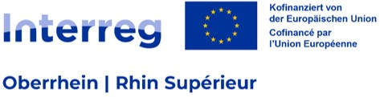

<link rel="stylesheet" href="{{ '/css/style.css' | relative_url }}">
<link rel="stylesheet" href="https://cdnjs.cloudflare.com/ajax/libs/font-awesome/6.0.0/css/all.min.css">

<!-- Bouton pour ouvrir/fermer le menu -->
<button id="menu-toggle" class="menu-button">
    <i class="fa fa-bars"></i> Menu
</button>

    <!-- Sélecteur de langue -->

    <button id="language-button" class="language-button"><i class="fa-solid fa-language"></i> Langue</button>
    

        <button class="lang-option" data-lang="fr">🇫🇷 Français</button>
        <button class="lang-option" data-lang="en">🇬🇧 English</button>
        <button class="lang-option" data-lang="de">🇩🇪 Deutsch</button>
    

<!-- Conteneur du menu rétractable -->

    <a href="index" class="tab-button"><i class="fa-solid fa-house"></i> Accueil</a>
    <a href="macroinv" class="tab-button"><i class="fa-solid fa-bug"></i> Galerie des macroinvertébrés de la Wieslauter</a>
    <a href="map" class="tab-button"><i class="fa-solid fa-map"></i> L’atlas en cartographie interactive</a>
    <a href="downloads" class="tab-button"><i class="fa-solid fa-floppy-disk"></i> Télécharger l’atlas en format pdf</a>
    <a href="contacts" class="tab-button"><i class="fa-solid fa-address-book"></i> Equipe du projet Interreg RiverDiv – Volet « Biodiversité et zones refuges »</a>

<h3> </h3>

    
    

<h1 class="translatable" data-key="welcome">Bienvenue sur l’Atlas RiverDiv !</h1>

<h2 class="translatable" data-key="project">Le projet Interreg RiverDiv « Volet Biodiversité et zones-refuges »</h2>

    
Le projet Interreg RiverDiv s'intéresse à notre capacité à mettre en œuvre une gestion intégrée et transfrontalière des écosystèmes aquatiques dans un contexte de changement climatique. Les recherches ici présentées sont celles portées par l’Ecole Nationale du Génie de l’Eau et de l’Environnement de Strasbourg (ENGEES) et le Laboratoire Image Ville Environnement de Strasbourg (LIVE) au sein du volet « Biodiversité et zones-refuge » de ce projet, porté par l’Université technique de Rhénanie-Palatinat Kaiserslautern-Landau. Elles portent sur la caractérisation des zones-refuges aquatiques, à travers l’analyse de la répartition des communautés de macro-invertébrés et de la structure des habitats variant selon les régimes hydrologiques et thermiques induits par le changement climatique. Suite à un travail de terrain et d'identification, l'atlas suivant a été produit pour permettre de visualiser les différents taxons présents et leurs proportions. Sur ce site, vous pouvez accéder à la version interactive de l’atlas ainsi qu’à sa version PDF. Une présentation des différents taxons observés sur la Wieslauter et de leurs caractéristiques est également disponible.

<h2 class="translatable" data-key="faq">A propos de ce site</h2>

<section id="faq">
    

        
<i class="fa-solid fa-chevron-right"></i>
A quoi sert cet atlas ?

        

Cet atlas a pour objectif de présenter plusieurs résultats issus des travaux menés sur les communautés de macroinvertébrés dans le cadre du projet Interreg RiverDiv. Il est disponible en format interactif et en format pdf, accompagné d’une galerie présentant les taxons de macroinvertébrés les plus couramment observés au sein de la Wieslauter.

    

    

        
<i class="fa-solid fa-chevron-right"></i>
Pourquoi les macroinvertébrés ?

        

Les macroinvertébrés aquatiques, en raison de leurs caractéristiques écologiques, sont d’excellents indicateurs de la qualité des milieux. Certains taxons, par leur polluo-sensibilité, permettent d’évaluer le niveau de pollution ou le degré de perturbation d’un cours d’eau. Des informations complémentaires sur les taxons observés sont disponibles dans l’onglet Galerie ainsi que dans l’atlas PDF.

    

    

        
<i class="fa-solid fa-chevron-right"></i>
Que sont les zones refuge ? A REVOIR !

        

Les zones refuge sont des espaces ausin desquels les individus vont pouvoir se protéger d'un danger (événement extrême, prédateur, etc.), se reposer, se nourri ou encore se reproduire.

    

    

        
<i class="fa-solid fa-chevron-right"></i>
Les données brutes sont-elles accessibles ?

        

Les données brutes d’observation des taxons de macroinvertébrés aquatiques présents sur la Wieslauter ne sont pas disponibles directement sur le site ni sur le dépôt GitHub. Si vous souhaitez y accéder ou obtenir des informations complémentaires, merci de contacter un membre de l’équipe (voir onglet Equipe).

    

</section>

<h2 class="translatable" data-key="partners">Partenaires du projet</h2>

    

<h2 class="translatable" data-key="links">Liens vers le projet</h2>

- <a href="https://nuw.rptu.de/projekte/riverdiv/" class="translatable" data-key="link1">Projet RiverDiv - Site de la RPTU</a>
- <a href="https://live.unistra.fr/recherches/hydrosystemes/projets/liste-des-projets/projet-interreg-riverdiv" class="translatable" data-key="link2">Projet RiverDiv - Site du LIVE</a>
