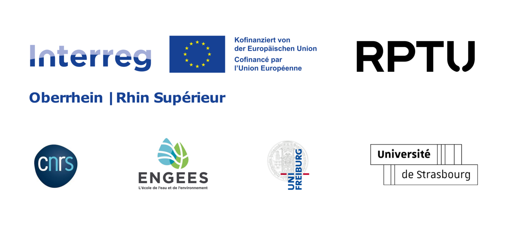

<link rel="stylesheet" href="{{ '/css/style.css' | relative_url }}">

    <a href="index" class="tab-button">Accueil</a>
    <a href="macroinv" class="tab-button">Macro invertébrés</a>
    <a href="map" class="tab-button">Carte Interactive</a>
    <a href="downloads" class="tab-button">Téléchargement</a>
    <a href="contacts" class="tab-button">Contacts</a>

    

# Bienvenue sur le site de l'atlas macro invertébrés du projet RiverDiv !

Dans le cadre du projet INTERREG RIVERDIV, des travaux comprenant des campagnes de terrain visent à étudier les zones refuges et les macro-invertébrés. Suite à un travail d'identification, l'atlas suivant a été produit pour permettre de visualiser les différents ordres présents et leurs proportions.

Sur ce site, vous pouvez accéder à la version interactive de l'atlas ainsi qu'à sa version PDF :
- [Carte interactive (atlas dynamique)](map)

- [Téléchargement de l'atlas en PDF](downloads)

## Liens vers le projet

- [Projet RiverDiv - Site de la RPTU](https://nuw.rptu.de/projekte/riverdiv/version-francaise)

- [Projet RiverDiv - Site du LIVE](https://live.unistra.fr/recherches/hydrosystemes/projets/liste-des-projets/projet-interreg-riverdiv)

## Foire aux questions

<link rel="stylesheet" href="https://cdnjs.cloudflare.com/ajax/libs/font-awesome/6.0.0/css/all.min.css">

<section id="faq">
    

        
<i class="fa-solid fa-chevron-down"></i> Pourquoi un tel site ?

        
Ce site permet de présenter plusieurs résultats concernant les macro invertébrés : carte interactive, atlas PDF, galerie présentant les différents taxons.

    

    

        
<i class="fa-solid fa-chevron-down"></i> Pourquoi les macro invertébrés ?

        
Les macro invertébrés, du fait de leur caractéristiques spécifiques, sont souvent étudiés pour évaluer l'état d'un milieu aquatique. Certains taxons, s'ils sont présents, permettent par exemple d'établir le niveau de pollution du milieu du fait de leur polluo-sensibilité. Vous pourrez retrouver des informations sur les différents taxons observés dans l'onglet correspondant ainsi que dans l'atlas PDF.

    

    

        
<i class="fa-solid fa-chevron-down"></i> Que sont les zones refuge ?

        
Les zones refuge sont des espaces ausin desquels les individus vont pouvoir se protéger d'un danger (événement extrême, prédateur, etc.), se reposer, se nourri ou encore se reproduire.

    

    

        
<i class="fa-solid fa-chevron-down"></i> Qui est derrière ce site ?

        
Au global, le projet RiverDiv s'articule autour de plusieurs axes sur lesquels sont associés différentes équipes. Notre équipe, que nous vous invitons à découvrir dans l'onglet contacts, étudie la notion de zones refuge et leur caractérisation, le tout appliqué aux macro invertébrés aquatiques. Cette équipe est constitué de membres de l'Ecole Nationale du Génie de l'Eau et de l'Environnement de Strasbourg (ENGEES) et du Laboratoire Image, Ville, Environnement (LIVE).

    

    

        
<i class="fa-solid fa-chevron-down"></i> Comment le site a-t-il été réalisé ?

        
Le site a été réalisé à l'aide des langages HTML, JavaScript et CSS. Le tout a été mis en ligne grâce à GitHub et GitHub Pages. La carte interactive est issue d'un travail sur le logiciel QGIS (à l'aide du plugin QGIS2WEB) et le rendu dynamique est permis par Leaflet.

    

    

        
<i class="fa-solid fa-chevron-down"></i> Les données brutes sont-elles accessibles ?

        
Les données brutes d'observations des différents taxons de macro invertébrés aquatiques présents sur la Wieslauter ne sont pas disponibles directement sur le site ou le dépôt GitHub. Si de telles données vous intéressent, veuillez prendre contacts avec l'un des membres de l'équipe.

    

</section>

## Partenaires du projet

    

