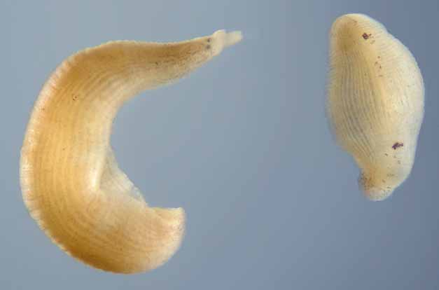

<link rel="stylesheet" href="{{ '/css/style.css' | relative_url }}">

    <a href="index" class="tab-button">Accueil</a>
    <a href="macroinv" class="tab-button">Macro invertébrés</a>
    <a href="map" class="tab-button">Carte Interactive</a>
    <a href="downloads" class="tab-button">Téléchargement</a>
    <a href="contacts" class="tab-button">Contacts</a>

    

# Galerie des macro-invertébrés

Cette partie est actuellement en construction !

<link rel="stylesheet" href="https://cdnjs.cloudflare.com/ajax/libs/font-awesome/6.0.0/css/all.min.css">

<section id="faq">
    

        
<i class="fa-solid fa-chevron-down"></i> Acantocéphales

        
En construction... 

    

    

        
<i class="fa-solid fa-chevron-down"></i> Achètes

        
En construction...

    

    

        
<i class="fa-solid fa-chevron-down"></i> Amphipodes

        
En construction...

    

    

        
<i class="fa-solid fa-chevron-down"></i> Annélidés

        
En construction...

    

    

        
<i class="fa-solid fa-chevron-down"></i> Bivalves

        
En construction...

    

    

        
<i class="fa-solid fa-chevron-down"></i> Coléoptères

        
En construction...

    

    

        
<i class="fa-solid fa-chevron-down"></i> Décapodes

        
En construction...

    

    

        
<i class="fa-solid fa-chevron-down"></i> Diptères

        
En construction...

    

    

        
<i class="fa-solid fa-chevron-down"></i> Ephéméroptères

        
En construction...

    

    

        
<i class="fa-solid fa-chevron-down"></i> Gastéropodes

        
En construction...

    

    

        
<i class="fa-solid fa-chevron-down"></i> Hétéroptères

        
En construction...

    

    

        
<i class="fa-solid fa-chevron-down"></i> Hydracariens

        
En construction...

    

    

        
<i class="fa-solid fa-chevron-down"></i> Isopodes

        
En construction...

    

    

        
<i class="fa-solid fa-chevron-down"></i> Némathelminthes

        
En construction...

    

    

        
<i class="fa-solid fa-chevron-down"></i> Odonates

        
En construction...

    

    

        
<i class="fa-solid fa-chevron-down"></i> Oligochètes

        
En construction...

    

    

        
<i class="fa-solid fa-chevron-down"></i> Plécoptères

        
En construction...

    

    

        
<i class="fa-solid fa-chevron-down"></i> Trichoptères

        
En construction...

    
  
</section>

