<link rel="stylesheet" href="{{ '/css/style.css' | relative_url }}">
<link rel="stylesheet" href="https://cdnjs.cloudflare.com/ajax/libs/font-awesome/6.0.0/css/all.min.css">

<!-- Bouton pour ouvrir/fermer le menu -->
<button id="menu-toggle" class="menu-button">
    <i class="fa fa-bars"></i> Menu
</button>

    <!-- Sélecteur de langue -->

    <button id="language-button" class="language-button"><i class="fa-solid fa-language"></i> Langue</button>
    

        <button class="lang-option" data-lang="fr">🇫🇷 Français</button>
        <button class="lang-option" data-lang="en">🇬🇧 English</button>
        <button class="lang-option" data-lang="de">🇩🇪 Deutsch</button>
    

<!-- Conteneur du menu rétractable -->

    <a href="index" class="tab-button"><i class="fa-solid fa-house"></i> Accueil</a>
    <a href="macroinv" class="tab-button"><i class="fa-solid fa-bug"></i> Macro invertébrés</a>
    <a href="map" class="tab-button"><i class="fa-solid fa-map"></i> Carte Interactive</a>
    <a href="downloads" class="tab-button"><i class="fa-solid fa-floppy-disk"></i> Téléchargement</a>
    <a href="contacts" class="tab-button"><i class="fa-solid fa-address-book"></i> Contacts</a>

<h1 class="translatable" data-key="macroinv2">Galerie des macro-invertébrés</h1>

Dans cette partie, vous trouverez les différents macro-invertébrés recensés au sein de l'atlas. De courtes descriptions et quelques photos vous permettront d'en apprendre plus à leur sujet.

<section id="faq">
    

        
<i class="fa-solid fa-chevron-right"></i>
Acantocéphales

        

            

Les acantocéphales, aussi connus sous le nom de vers à tête épineuse, sont des parasites capables de s’accrocher à leurs hôtes. N’ayant pas de vie libre, ils parasitent les arthropodes à l’état juvénile puis contaminent les vertébrés à l’âge adulte. Ces derniers sont contaminés en mangeant les hôtes intermédiaires. C’est en modifiant le comportement des hôtes intermédiaires pour les forcer à se faire manger que les hôtes finaux seront contaminés.

            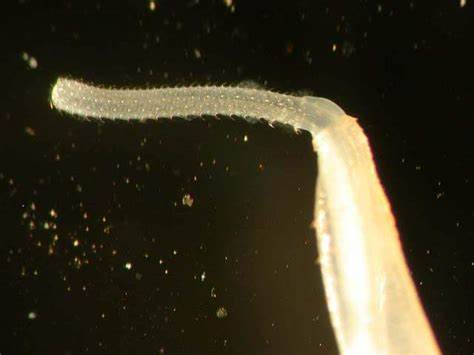
        

    

    

        
<i class="fa-solid fa-chevron-right"></i>
Achètes

        

            

De la classe des annélidés, les sangsues disposent de ventouses et sont hermaphrodites. Certaines espèces sont hématophages. Les achètes peuvent être considérés comme polluo-résistants notamment du fait de leur résistance à des conditions d’hypoxie. Cela fait souvent de ces derniers les seuls prédateurs là où la pollution organique est élevée.
Prédatrices ou parasites, les achètes peuvent se disperser par le biais du courant.

            
        

    

    

        
<i class="fa-solid fa-chevron-right"></i>
Amphipodes

        

            

Les amphipodes se caractérisent notamment par l’aplatissement latéral de leurs corps ainsi que par le fait qu’ils soient détritivores.
Capables de coloniser tous les types d’habitats, ils sont souvent la proie de poissons et d’oiseaux. Le parasitage par des larves d’acantocéphales est également courant (forme une tache orangée). Enfin, les amphipodes sont tolérants face à la pollution.

            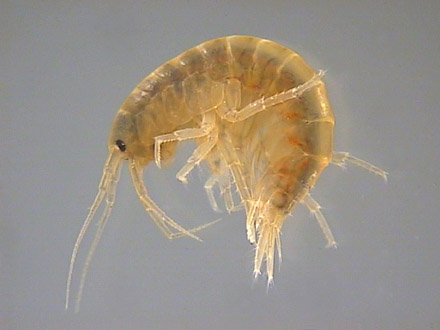
        

    

    

        
<i class="fa-solid fa-chevron-right"></i>
Annélidés

        

            

Les annélides, ou vers, se composent d’une succession de segments. La plupart d’entre eux vivent essentiellement dans l’eau et s’avèrent être tolérant à la pollution. Cet embranchement englobe trois classes : les polychètes, les oligochètes et les achètes.

            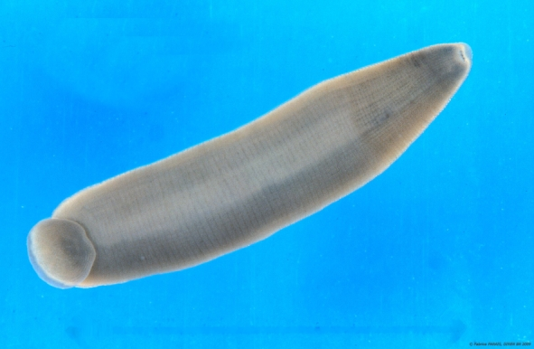
        

    

    

        
<i class="fa-solid fa-chevron-right"></i>
Bivalves

        

            

Faisant partie de l’embranchement des mollusques, la classe des bivalves représente les individus de tout types et de toutes tailles possédant deux valves. Les bivalves d’eau douce sont des filtreurs (phytoplancton, bactéries, fins débris organiques) et sont également les hôtes de nombreux parasites. Les individus du genre Pisidium (famille des Sphaeriidae) et de la famille Unionacea ont une grande résistance à l’hypoxie. Ce type de résistance ne se retrouve pas dans d’autres familles ou genres.

            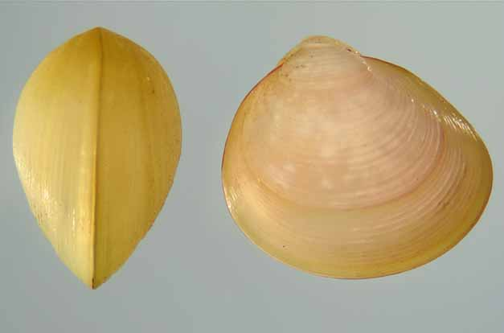
        

    

    

        
<i class="fa-solid fa-chevron-right"></i>
Coléoptères

        

            

Les coléoptères sont polymorphes et de tailles variées. Chez les larves, le régime alimentaire est également varié (appareil buccal de type broyeur, herbivores stricts, détritivores, algivores, carnivores, etc.). Les adultes ont, quant à eux, tous un appareil buccal de type broyeur. Certains sont prédateurs mais la majorité sont détritivore ou algivore. Enfin, les coléoptères sont capables de coloniser tous les types de milieux aquatiques et leur tolérance à la pollution est moyenne.

            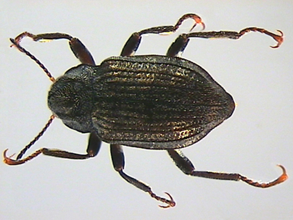
            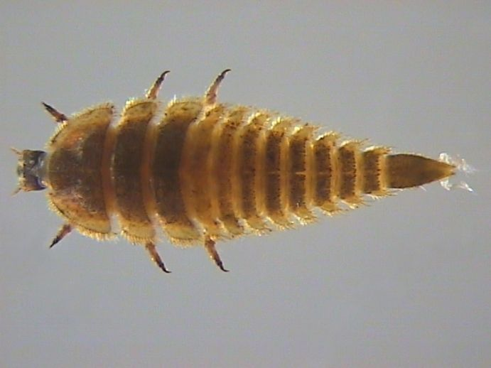
        

    

    

        
<i class="fa-solid fa-chevron-right"></i>
Décapodes

        
 
            

Les décapodes se caractérisent par leur cinq paires de pattes. On y retrouve donc notamment des écrevisses ou des crabes. 
La compétition est importante chez les écrevisses (espèces indigènes vs étrangères). De plus, certaines espèces sont fouisseurs et fragilisent les berges. Il est à noter que les décapodes sont moyennement résistants à la pollution.

            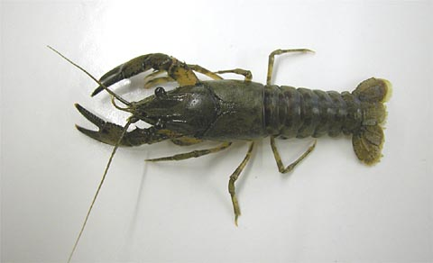
        

    

    

        
<i class="fa-solid fa-chevron-right"></i>
Diptères

        

            

Les diptères sont répandus dans toutes les grandes régions du monde. De nombreuses espèces sont fouisseurs et les régimes alimentaires sont variés (broyeur, détritivore, racleur, etc.). Les larves de diptères se caractérisent notamment par l’absence de pattes thoraciques articulées. Les adultes, quant à eux, ont une paire d’ailes et un appareil buccal de type lécheur, piqueur ou les deux. Enfin, en ce qui concerne la tolérance à la pollution, les Chironomidae (famille la plus importante) sont tolérants mais les autres familles ne le sont que moyennement.

            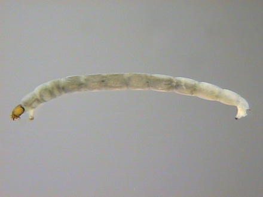
            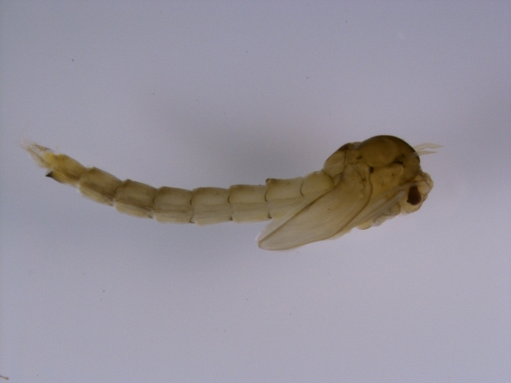
        

    

    

        
<i class="fa-solid fa-chevron-right"></i>
Ephéméroptères

        

            

Les éphéméroptères forment un groupe présent dans le monde entier dont la distribution est très diversifiée (présence aussi bien en eau courante que stagnante). Cette diversité concerne aussi bien la relation avec le substrat (individus fouisseurs, rampants, nageurs, etc.) que l’alimentation (individus broyeurs, détritivores, filtreurs, prédateurs, etc.). La durée de vie des individus varie de 3 à 6 mois en général. Enfin, ce groupe fait partie des bioindicateurs d’eaux peu polluées utilisé en France pour le suivi de la qualité des milieux aquatiques.

            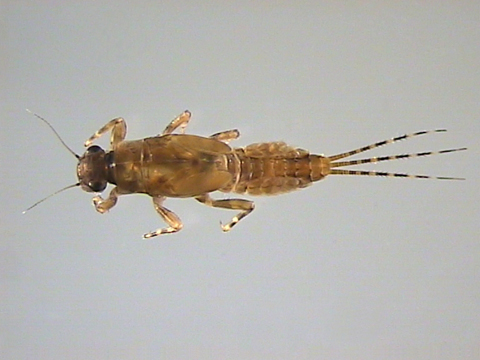
        

    

    

        
<i class="fa-solid fa-chevron-right"></i>
Gastéropodes

        

            

Groupe rassemblant les mollusques asymétriques, les gastéropodes sont des individus herbivores et détritivores dont la durée de vie s’élève entre 9 et 15 mois. Les gastéropodes sont souvent la proie de poissons et d’oiseaux ainsi que de certains macroinvertébrés. Leur dispersion se fait par le biais des oiseaux, crues et canaux. Enfin, les individus de ce groupe ont une préférence pour les eaux à pH plus basique qu’acide.

            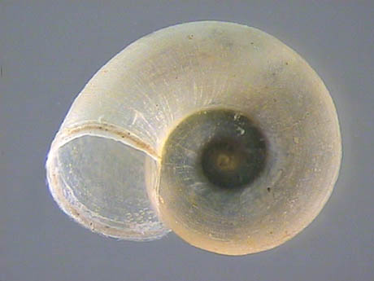
        

    

    

        
<i class="fa-solid fa-chevron-right"></i>
Hétéroptères

        

            

Les hétéroptères sont un sous-ordre des hémiptères. Ces derniers se caractérisent par la transformation de l’appareil buccal en rostre. Leur régime alimentaire est, par conséquent, liquide (seuls certains genres ont une modification permettant l’absorption de particules). La majorité des hétéroptères s’avère être des prédateurs bien que certains genres soient détritivores. Enfin, les hétéroptères sont moyennement tolérant à la pollution.

            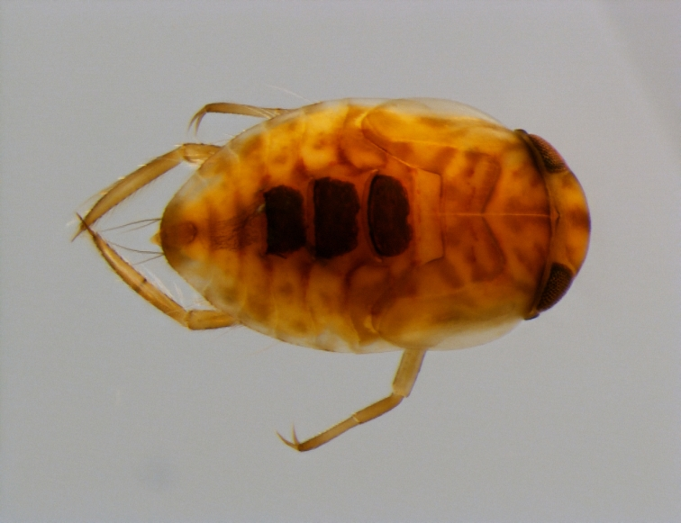
        

    

    

        
<i class="fa-solid fa-chevron-right"></i>
Hydracariens

        

            

Les hydracariens forment un groupe très diversifié et abondant. Ces derniers sont omniprésents dans presque tous les types d’habitats et s’avèrent être d’excellents nageurs. Toutefois, les ruisseaux et marais sont des habitats typiques. A l’état larvaire, les individus se développent par parasitisme en se fixant sur des insectes. Les adultes, quant à eaux, sont capables de prédation. D’ailleurs, les chélicères et palpes des individus varient selon le régime alimentaire. Enfin, les hydracariens sont moyennement tolérant à la pollution.

            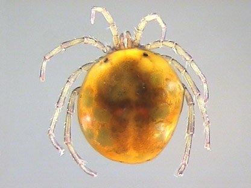
        

    

    

        
<i class="fa-solid fa-chevron-right"></i>
Isopodes

        

            

Caractérisés par un aplatissement dorso-ventral, les isopodes forment un groupe d’individus variés qui peuvent être herbivores, détritivores, carnivores ou encore parasites. Les isopodes sont la proie des poissons, des sangsues, des oiseaux ou encore des planaires. Par ailleurs, les isopodes ont une préférence pour les milieux lentiques et sont peu aptes à coloniser de nouveaux milieux bien qu’ils soient souvent entraînés en dérive par le courant. Enfin, les isopodes sont tolérants face à la pollution.

            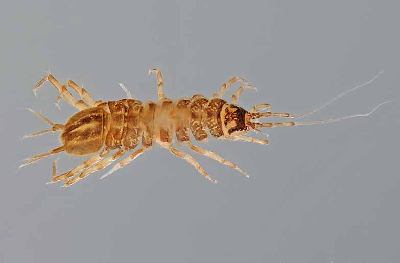
        

    

    

        
<i class="fa-solid fa-chevron-right"></i>
Némathelminthes

        

            

Les némathelminthes d’eau douce se divisent en 2 classes : les nématodes et les gordiacés. Les nématodes sont très abondants en eau douce mais la plupart sont microscopiques. Ils sont allongés et blancs. Les gordiacés sont, quant à eux, des parasites larvaires qui deviennent libres à l’âge adulte. Ils sont très allongés et bruns. La tolérance à la pollution des némathelminthes est moyenne.

            
            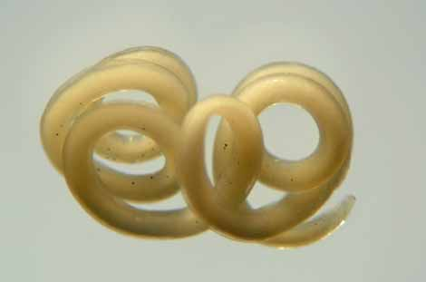
        

    

    

        
<i class="fa-solid fa-chevron-right"></i>
Odonates

        

            

Les odonates se rassemblent en 2 sous-ordre principaux : les zygoptères (qui ont des ailes de longueurs similaires)  et les anisoptères (qui ont des ailes de longueurs différentes). Les larves d’odonates sont exclusivement prédatrices. Les adultes, quant à eux, sont des prédateurs diurnes d’insectes ailés. La durée de vie est de quelques semaines pour l’adulte et de quelques années pour la larve. Les odonates sont surtout trouvés en milieux stagnants bien que certains genres puissent être trouvés en cours d’eau. Enfin, leur tolérance à la pollution est moyenne.

            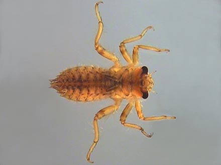
        

    

    

        
<i class="fa-solid fa-chevron-right"></i>
Oligochètes

        

            

Les oligochètes sont des vers aussi bien terrestres qu’aquatiques dont le corps segmenté est couvert de soies permettant la reptation. On les retrouve dans tous les types de milieux. Ces derniers sont qualifiés de polluo-résistants.

            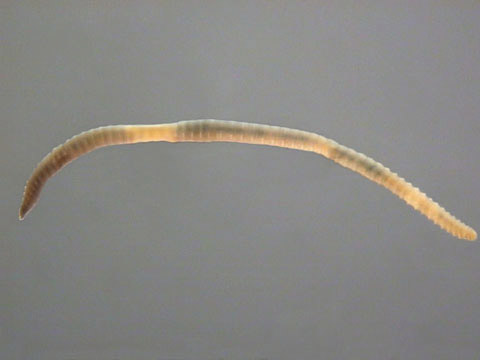
        

    

    

        
<i class="fa-solid fa-chevron-right"></i>
Plécoptères

        

            

Les plécoptères sont des invertébrés dont la diversité est plus élevée dans les cours d’eau supérieur. Ils sont également plus abondants dans les eaux courantes. La dispersion se fait par dérive pour les larves et par le biais des femelles adultes qui vivent plus longtemps. Les individus peuvent être des broyeurs, des racleurs ou des prédateurs selon le genre. Ils sont la proie de poissons, d’oiseaux et d’autres macroinvertébrés. Les larves des plécoptères sont utilisés comme bioindicateur du fait de leur grande sensibilité aux taux en oxygène dissous dans l’eau. Dans la globalité, ils sont sensibles à la pollution.

            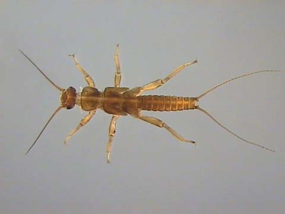
        

    

    

        
<i class="fa-solid fa-chevron-right"></i>
Trichoptères

        

            

Les trichoptères forment un groupe dont les larves et les nymphes sont aquatiques. De nombreuses larves sont dites “à étui” car elles construisent des fourreaux divers pour se protéger. Certaines larves peuvent, quant à elle, être libres et errantes ou fixes. Les trichoptères peuvent être des filtreurs, des racleurs ou des prédateurs.
Les adultes sont souvent la proie des oiseaux et des chiroptères. Enfin, les trichoptères sont en général sensibles à la pollution.

            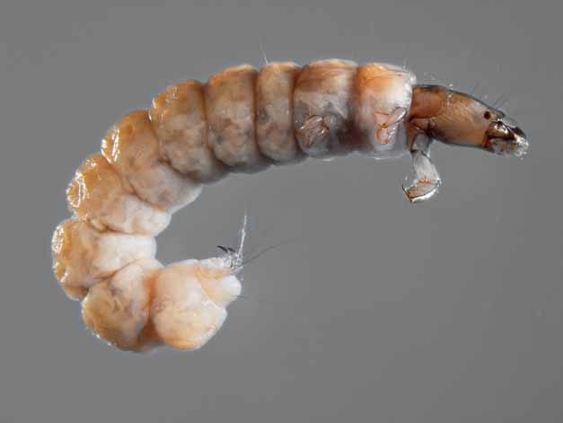
            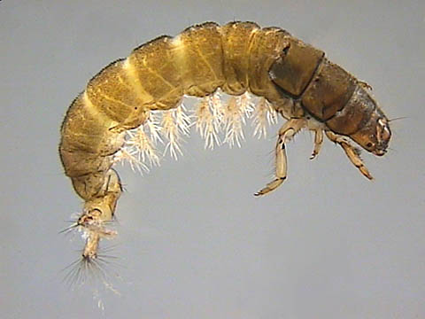
        

    
  
</section>

