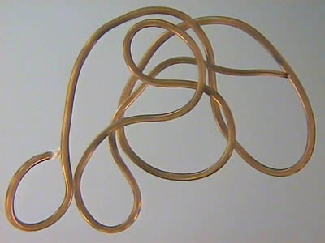

<link rel="stylesheet" href="{{ '/css/style.css' | relative_url }}">
<link rel="stylesheet" href="https://cdnjs.cloudflare.com/ajax/libs/font-awesome/6.0.0/css/all.min.css">

<!-- Bouton pour ouvrir/fermer le menu -->
<button id="menu-toggle" class="menu-button">
    <i class="fa fa-bars"></i> Menu
</button>

    <!-- Sélecteur de langue -->

    <button id="language-button" class="language-button"><i class="fa-solid fa-language"></i> Langue</button>
    

        <button class="lang-option" data-lang="fr">🇫🇷 Français</button>
        <button class="lang-option" data-lang="en">🇬🇧 English</button>
        <button class="lang-option" data-lang="de">🇩🇪 Deutsch</button>
    

<!-- Conteneur du menu rétractable -->

    <a href="index" class="tab-button"><i class="fa-solid fa-house"></i> Accueil</a>
    <a href="macroinv" class="tab-button"><i class="fa-solid fa-bug"></i> Macro invertébrés</a>
    <a href="map" class="tab-button"><i class="fa-solid fa-map"></i> Carte Interactive</a>
    <a href="downloads" class="tab-button"><i class="fa-solid fa-floppy-disk"></i> Téléchargement</a>
    <a href="contacts" class="tab-button"><i class="fa-solid fa-address-book"></i> Contacts</a>

# Galerie des macro-invertébrés

Cette partie est actuellement en construction !

<section id="faq">
    

        
<i class="fa-solid fa-chevron-right"></i> Acantocéphales

        

            
En construction...

            
        

    

    

        
<i class="fa-solid fa-chevron-right"></i> Achètes

        

            
En construction...

            
        

    

    

        
<i class="fa-solid fa-chevron-right"></i> Amphipodes

        

            
En construction...

            
        

    

    

        
<i class="fa-solid fa-chevron-right"></i> Annélidés

        

            
En construction...

            
        

    

    

        
<i class="fa-solid fa-chevron-right"></i> Bivalves

        

            
En construction...

            
        

    

    

        
<i class="fa-solid fa-chevron-right"></i> Coléoptères

        

            
En construction...

            
            
        

    

    

        
<i class="fa-solid fa-chevron-right"></i> Décapodes

        

            
En construction...

            
        

    

    

        
<i class="fa-solid fa-chevron-right"></i> Diptères

        

            
En construction...

            
            
        

    

    

        
<i class="fa-solid fa-chevron-right"></i> Ephéméroptères

        

            
En construction...

            
        

    

    

        
<i class="fa-solid fa-chevron-right"></i> Gastéropodes

        

            
En construction...

            
        

    

    

        
<i class="fa-solid fa-chevron-right"></i> Hétéroptères

        

            
En construction...

            
        

    

    

        
<i class="fa-solid fa-chevron-right"></i> Hydracariens

        

            
En construction...

            
        

    

    

        
<i class="fa-solid fa-chevron-right"></i> Isopodes

        

            
En construction...

            
        

    

    

        
<i class="fa-solid fa-chevron-right"></i> Némathelminthes

        

            
En construction...

            
            
        

    

    

        
<i class="fa-solid fa-chevron-right"></i> Odonates

        

            
En construction...

            
        

    

    

        
<i class="fa-solid fa-chevron-right"></i> Oligochètes

        

            
En construction...

            
        

    

    

        
<i class="fa-solid fa-chevron-right"></i> Plécoptères

        

            
En construction...

            
        

    

    

        
<i class="fa-solid fa-chevron-right"></i> Trichoptères

        

            
En construction...

            
            
        

    
  
</section>

